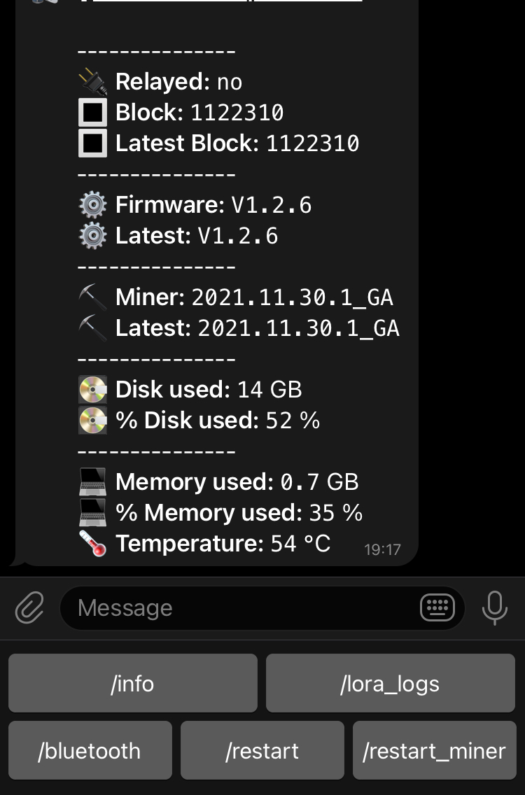

# Heltec_helium_miner_telegram_bot
A telegram bot for heltec helium miner to get information about miner.

## Installation
- Create a bot on telegram and get the Bot token
- Edit the ".env" file with your information

- Node v14.18.1
- Tested on ubuntu 18.04
- You can run in background using screen or a crontab @reboot

```bash
# Install'
npm install 
```


```bash
#Run Bot
npm start
```

## Commands on Telegram app

```bash
# Get miner information'
/menu

# Get miner information'
/info

# Restart the device'
/restart_device

# Restart the miner process
/restart_miner

#Start bluetooth pairing
/bluetooth
```




## Contributing
Pull requests are welcome. For major changes, please open an issue first to discuss what you would like to change.
